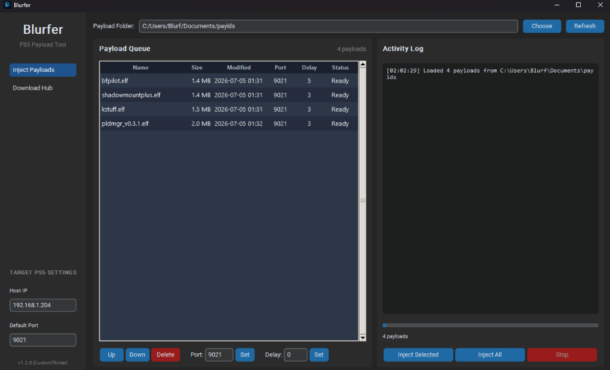
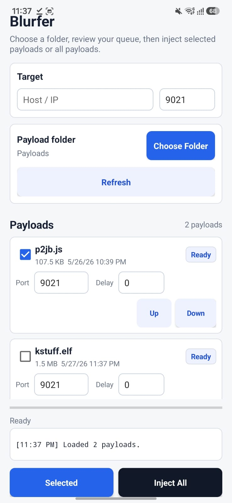

# Blurfer

Blurfer is a payload sender for Windows, Linux, and Android. It sends files as raw bytes over TCP and keeps a reusable payload queue with per-file ports, delays, and ordering.

No payload files are bundled with Blurfer.

## Download

Get the latest build from the [Releases](https://github.com/ItsBlurf/Blurfer/releases/latest) page.

| Platform | File | Notes |
| --- | --- | --- |
| Windows | `Blurfer.exe` | Portable executable |
| Linux | `Blurfer-x86_64.AppImage` | Recommended Linux download |
| Linux | `Blurfer-linux-x86_64.bin` | Standalone Linux binary |
| Android | `Blurfer.apk` | Android 6.0 or newer |
| macOS | [duperin/payload-sender](https://github.com/duperin/payload-sender/) | Native macOS alternative. Thanks to duperin. |

## Screenshots

### Desktop



### Android



## Features

- Send one payload, selected payloads, or the full queue.
- Choose any payload folder and refresh it at any time.
- Set a different TCP port and delay for each payload.
- Reorder payloads before sending.
- Save the selected folder, target, queue order, ports, and delays.
- Drag files into the desktop app to copy them into the selected folder.
- Preview folders and permanently delete selected payload files on desktop.
- Ignore hidden, trashed, incomplete, and unreadable entries when loading folders.

## Quick Start

1. Download the build for your platform.
2. Choose the folder containing your payload files.
3. Enter the target host or IP address.
4. Review the queue, ports, and delays.
5. Send the selected payloads or the full queue.

The default port is `9021`. A payload's delay is applied immediately before that payload is sent.

## Build From Source

Requirements:

- Python 3.10 or newer for Windows and Linux builds
- Java 17, Android SDK, and Gradle for Android builds

Windows:

```powershell
.\build_windows.ps1
```

Linux:

```bash
chmod +x ./build_linux.sh
./build_linux.sh
```

Android:

```powershell
.\build_android.ps1
```

or:

```bash
chmod +x ./build_android.sh
./build_android.sh
```

Build outputs are written to `dist/`.

## Responsibility

Blurfer only sends files selected by the user. Use it only with devices and software you own or are authorized to test. Payload behavior is outside the scope of this project.
